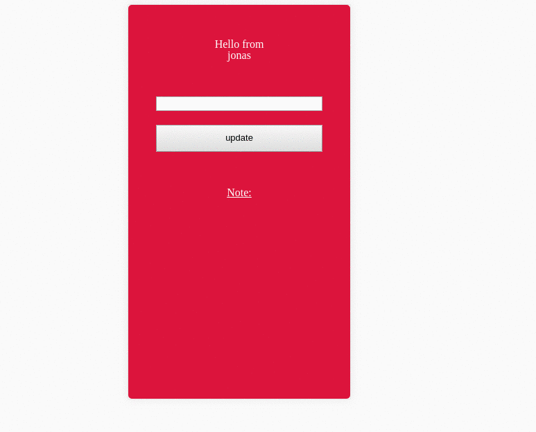
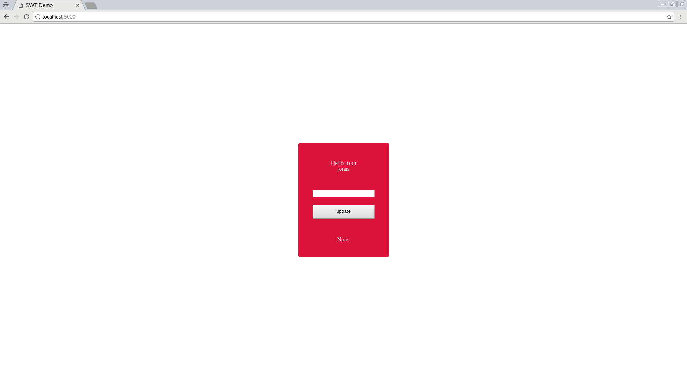
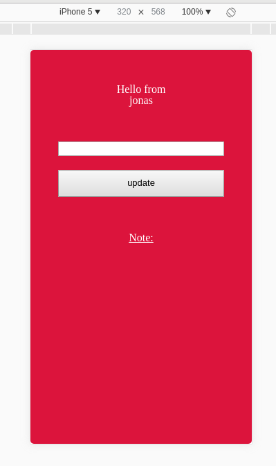

# Flask redis note app

An app which I created to demonstrate docker swarm capabilities.

The flask app is stateless, which means it could be horizontally scaled with ease.

## App Demo




## Steps for Docker Swarm demonstration

```
docker network create --driver overlay swt-demo
docker service create --name redis --network swt-demo redis
docker service create --update-delay 30s --name backend --replicas 1 --network swt-demo --publish 80:5000 jonadev95/swt-demo
docker service scale backend=3
docker service update --image jonadev95/swt-demo-v2 backend
docker service update --rollback --update-delay 0s
```


## How it works

1. When you hit the side and there's not cookie, it will be created(based on the time, not secure but good enough for the demo) and set
2. If you update your note, this cookie will be used as key and your note as a value

## Views

### Desktop


### Mobile



